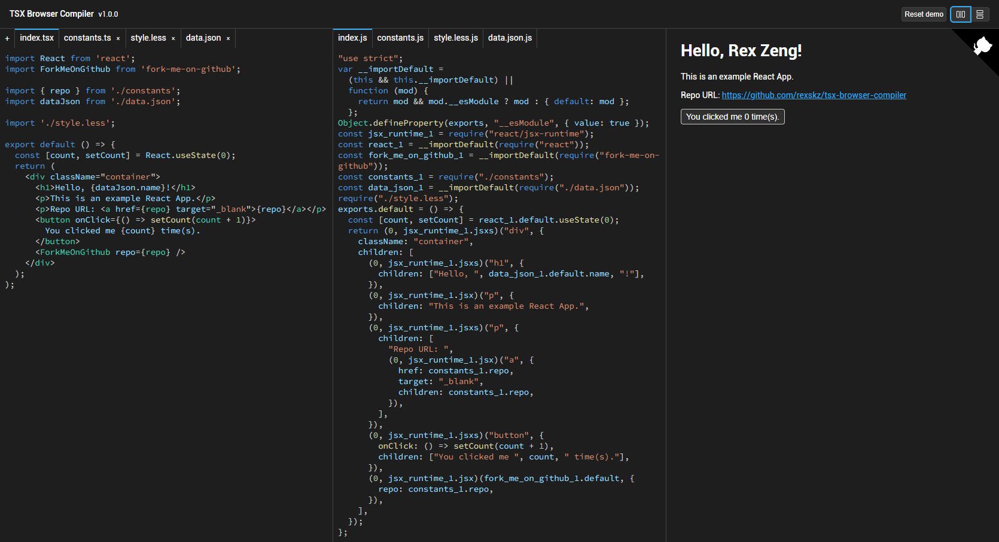

# TSX Browser Compiler

Transform a set of `.tsx` (as well as other extensions) files into React elements, extremely useful for the "live edit" feature in component library documents. [Try it out in the playground!](https://rexskz.github.io/tsx-browser-compiler/)



## Install

You can install `tsx-browser-compiler` via various package managers.

```sh
# using npm
npm i tsx-browser-compiler --save

# using yarn
yarn add tsx-browser-compiler

# using pnpm
pnpm add tsx-browser-compiler
```

## Quick Start

To transform the TSX codes to React elements, just provide them to `asyncTsxToElement` and render the `component` field (or `errors` field if you'd like to display errors) in the returned value.

CSS is also supported and will be auto-injected into the document head. You may use the `cleanup` field to remove them (e.g. use a `useEffect` with a dependency `component`).

```tsx
// Transforming can be slow, so it's recommended to debounce this call.
// e.g. use `useDebouncedEffect` written in `playground/hooks/use-debounced-effect.ts`.
const { component, errors, cleanup } = await asyncTsxToElement({
  sources: {
    'index.tsx': `
      import React from 'react';
      import './style.css';

      export default function MyComponent() {
        return <div className="my-component">Hello, world!</div>;
      }
    `,
    'style.css': `
      .my-component {
        color: red;
      }
    `,
  },
});
```

## Other Similar Projects

- [react-live](https://github.com/FormidableLabs/react-live): edit React code and view the result in real-time. It uses `sucrase`, a small and fast Babel alternative, to transform the code. If you only have one `.tsx` file and don't need to emit type errors, this is a better choice.
- [@codesandbox/sandpack-react](https://github.com/codesandbox/sandpack): a general tool to run code in the browser, created by CodeSandbox. It's more powerful and flexible, but also more complex and may be overkill for simple use cases (e.g. the "live edit" feature in component library documents).

## Advanced Usage

There are more options you can provide to `asyncTsxToElement`.

### The `entryFile` Field

- Type: `string`
- Description: the entry file of the project. By default, it's the first file in the `sources` object.

### The `resolve` Field

- Type: `Partial<ResolveConfig>`
- Description: provide custom resolution options: `extensions`, `externals`, `cdnPrefix`.

#### Extensions

The `resolve.extensions` field is an array of strings that will be appended to the generated file path when resolving modules. By default, it's `['.js']`.

For example, assume we have `require('./example')`, and the `resolve.extensions` is set to `['.mjs', '.cjs', '.js']`, the resolver will try to load the following files:

- `./example.mjs`
- `./example.cjs`
- `./example.js`
- `./example/index.mjs`
- `./example/index.cjs`
- `./example/index.js`

Note that `.tsx`, `.ts` and `.json` files will all be converted to `.js` files, please see the code in playground.

#### Externals

The `resolve.externals` field is an object that maps module names to global variables. There are several types of externals:

- Window: if `window[value]` exists, it will be treated as the module.
- URL: if the value starts with `https://` or `http://`, it will be treated as a UMD file URL. The resolver will load the file and get its exports.
- Semver: the resolver will try to load the library from a CDN with the given version. You can specify which CDN to use in the `cdnPrefix` field (we use UNPKG by default).

Note that if you specify the `cdnPrefix` field, your CDN must support returning the correct UMD file like UNPKG, e.g. `${cdnPrefix}/axios` should be redirected to `${cdnPrefix}/axios@[a.b.c]/dist/axios.min.js` or return the file directly without redirection.

Here are some examples.

```tsx
const { component, cleanup } = await asyncTsxToElement({
  resolve: {
    externals: {
      // assume `window.React` exists
      'react': 'React',
      // load `axios` UMD file from URL
      'axios': 'https://unpkg.com/axios@1.6.8/dist/axios.min.js',
      // load `antd` from CDN with the version `5.16.2`
      'antd': '5.16.2',
    },
    // jsDelivr is a CDN service that returns the correct UMD file directly
    cdnPrefix: 'https://cdn.jsdelivr.net/npm/',
  },
});
```

### The `requireFn` Field

- Type: `(absolutePath: string) => any`
- Description: provide a custom `require` function to fully control the module resolution. For example, if you already have the exports of module `/example1.js` and `/example2.js`, you can provide a custom `require` function to return them.

```tsx
import React from 'react';
import { example1, example2 } from './mocks';

const { component, cleanup } = await asyncTsxToElement({
  requireFn: absolutePath => {
    if (absolutePath === 'react') {
      return React;
    }
    if (absolutePath === '/example1.js') {
      return example1;
    }
    if (absolutePath === '/example2.js') {
      return example2;
    }
  },
});
```

Notice that for most scenarios, you don't need to provide a custom `require` function, the `resolve.externals` field is enough.

### The `rules` Field

- Type: `ModuleRule[]`
- Description: like Webpack's module rules, you can provide custom rules to transform the source code.

#### Module Rules

Sometimes you may want to transform the source code before it's executed, or you have to use the non-js files. The `rules` field provides a way to do this.

```tsx
import less from 'less';

const { component, cleanup } = await asyncTsxToElement({
  rules: [
    {
      test: /\.less$/,
      use: [
        /**
         * @param content The content of the file
         * @param meta Meta information, including `filename`, `options` and other custom fields
         * @param callback The callback function to return the transformed content
         */
        (content, meta, callback) => {
          less.render(
            content,
            { filename: meta.filename },
            (err: Error, result: { css: string }) => {
              if (err) {
                callback(err, '', meta);
              } else {
                callback(null, result.css, meta);
              }
            },
          );
        },
      ],
    },
  ],
});
```

Here is an example of passing `options` to the rule.

```tsx
import less from 'less';

const { component, cleanup } = await asyncTsxToElement({
  rules: [
    {
      test: /\.less$/,
      use: [
        {
          loader: (content, meta, callback) => { ... },
          // will be passwd to the `meta` parameter
          options: { ... },
        },
      ],
    },
  ],
});
```

#### Adjust the Order of Rules

By default, the rules are applied in the order they are provided. If you want to adjust the order of the rules, you can use the `rules[].enforce` field. The value can be `'pre'` or `'post'`.

```tsx
const { component, cleanup } = await asyncTsxToElement({
  rules: [
    { test: /\.less$/, use: [Loader1], enforce: 'post' },
    { test: /\.less$/, use: [Loader2], enforce: 'pre' },
    { test: /\.less$/, use: [Loader3] },
    { test: /\.less$/, use: [Loader4] },
  ],
});
```

All loaders with `enforce: 'pre'` will be executed before the normal loaders, and all loaders with `enforce: 'post'` will be executed after the normal loaders, which means the execution order is `Loader2` -> `Loader3` -> `Loader4` -> `Loader1`.

#### Pitching Loader

Loaders are much like pure functions that receive the content of the file and return the transformed content. The `rules[].use` field is like `compose` in functional programming - the first loader is the last one to be executed, and the last loader, on the contrary, is the first one to be executed.

However, sometimes you may want to gather information before the loaders are executed, or to skip the rest of the loaders and return the content directly. You can use the `pitch` field in the loader.

```tsx
const metaKey = Symbol('buildTimeMeasurementLoaderMetaKey');

interface ExtendedLoaderMeta extends LoaderMeta {
  [metaKey]: {
    startTime: number;
    contentLength: number;
  };
}

const BuildTimeMeasurementLoader = (content: string, meta: ExtendedLoaderMeta) => {
  const endTime = Date.now();
  const { startTime, contentLength } = meta[metaKey];
  console.log(`LessLoader: transform ${meta.filename} (${contentLength} chars) cost ${endTime - startTime}ms`);
};

BuildTimeMeasurementLoader.pitch = (content: string, meta: ExtendedLoaderMeta) => {
  if (!meta[metaKey]) {
    meta[metaKey] = {
      startTime: Date.now(),
      contentLength: content.length,
    };
  }
};

const { component, cleanup } = await asyncTsxToElement({
  rules: [
    { test: /\.less$/, use: [BuildTimeMeasurementLoader, LessLoader] },
  ],
});
```

In this example, `BuildTimeMeasurementLoader` will measure the time cost of the `LessLoader` and log it to the console. The execution order is:

1. `BuildTimeMeasurementLoader.pitch`, which will store the start time and content length in the `meta` object.
2. `LessLoader.pitch` (if exists).
3. `LessLoader`, which should transform the Less content to CSS.
4. `BuildTimeMeasurementLoader`, which will log the time cost based on the previously stored start time.

An example message in console might be:

```text
LessLoader: transform /style.less (995 chars) cost 4ms
```

### The `displayName` Field

- Type: `string`
- Description: the display name of the transformed component. By default, it's `TsxToElement`.

## Roadmap

- [x] Support TSX and TS files.
- [x] Support CSS and JSON files.
- [x] Support externals from `window`, URL and CDN.
- [x] A simple version of the resolution algorithm.
- [x] A simple version of module rules and loaders implementation.
- [x] A usable playground.
- [ ] Let the `enforce` and `pitch` fields work more like Webpack.
- [ ] Support more file types natively (issues and PRs are welcomed).
- [ ] Support changing more options in the playground.
- [ ] Export the playground components and hooks.
- [ ] Use loaders to refactor TS, CSS and JSON support.
- [ ] Add more examples and use cases.
- [ ] Add unit tests.

## License

MIT
